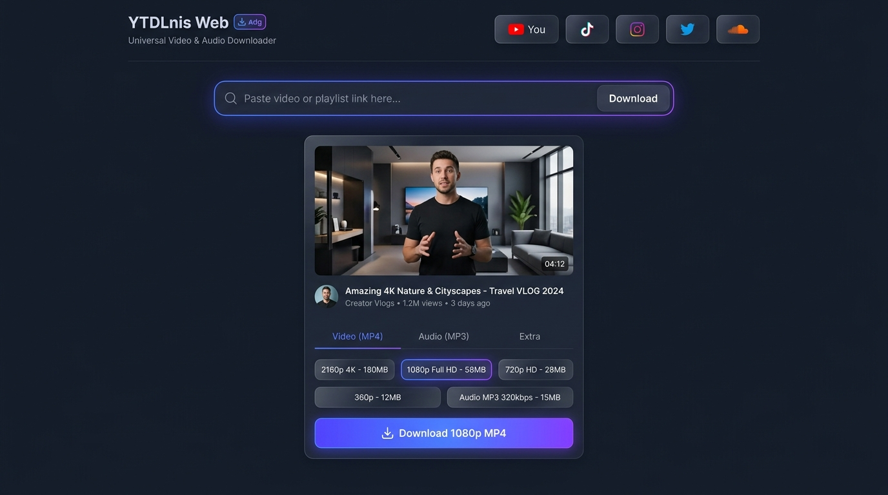

# YTDLnis Web 🚀

> **Universal Video & Audio Downloader** para navegador web, inspirado en la popular aplicación de Android [YTDLnis](https://github.com/deniscerri/ytdlnis) de Denis Çerri.



## 💡 Características principales

- 🌐 **Soporte de más de 1000 plataformas**: YouTube, TikTok, Instagram, Twitter/X, SoundCloud, Facebook, Twitch, Vimeo y más (potenciado por **yt-dlp**).
- 🎬 **Selector de Calidad Inteligente**:
  - **Video (MP4)**: 4K (2160p), 2K (1440p), Full HD (1080p), HD (720p), SD (480p, 360p).
  - **Audio (MP3 / FLAC / M4A / OPUS)**: 320 kbps (Alta fidelidad), 192 kbps (Estándar), 128 kbps (Ligero).
  - Cálculo aproximado de peso de archivo en megabytes (*MB*).
- ✂️ **Corte y fragmentación**: Recorta inicio y fin (HH:MM:SS) antes de descargar.
- ⚡ **Progreso en tiempo real**: Porcentaje de avance, velocidad de descarga y tiempo restante (ETA).
- 📑 **Soporte de listas de reproducción (Playlists)**: Detección automática y selección individual de pistas.
- 🎨 **Diseño Moderno**: Interfaz oscura con estética Glassmorphism, efectos de brillo y adaptación para pantallas móviles y de escritorio.

---

## 🛠️ Requisitos Previos

- **Python 3.10+**
- **Node.js 18+**
- **FFmpeg** (instalado en el sistema para unión de audio/video y conversiones)

---

## 🚀 Inicio Rápido (1 solo clic)

Simplemente ejecuta el archivo:
```cmd
run.bat
```
O desde la terminal PowerShell:
```powershell
cd backend
.\venv\Scripts\python.exe -m uvicorn app.main:app --host 0.0.0.0 --port 8000 --reload
```

Abre tu navegador en:
👉 **`http://localhost:8000`**

---

## 💻 Desarrollo (Modo Dev con Hot-Reload)

Si deseas modificar la interfaz en tiempo real:

1. **Backend (Terminal 1)**:
   ```bash
   cd backend
   .\venv\Scripts\activate
   uvicorn app.main:app --reload --port 8000
   ```

2. **Frontend (Terminal 2)**:
   ```bash
   cd frontend
   npm run dev
   ```
   Abre `http://localhost:3000` (el frontend redirige las peticiones `/api` al backend en el puerto 8000 automáticamente).

Para compilar cambios del frontend al servidor final de producción:
```bash
cd frontend
npm run build
```

---

## 📁 Estructura del Proyecto

```
YTDLnis/
├── backend/
│   ├── app/
│   │   ├── api/
│   │   │   └── routes.py         # Endpoints REST (/api/info, /api/download)
│   │   ├── core/
│   │   │   └── ytdlp_runner.py   # Motor yt-dlp con callbacks de progreso
│   │   └── main.py               # Aplicación FastAPI y servidor estático
│   ├── downloads/                # Archivos temporales generados
│   └── venv/                     # Entorno virtual de Python
├── frontend/
│   ├── src/
│   │   ├── App.jsx               # Interfaz principal de usuario
│   │   ├── index.css             # Estilos y animaciones Glassmorphism
│   │   └── main.jsx
│   ├── dist/                     # Build de producción
│   └── package.json
├── run.bat                       # Lanzador directo para Windows
└── README.md
```
